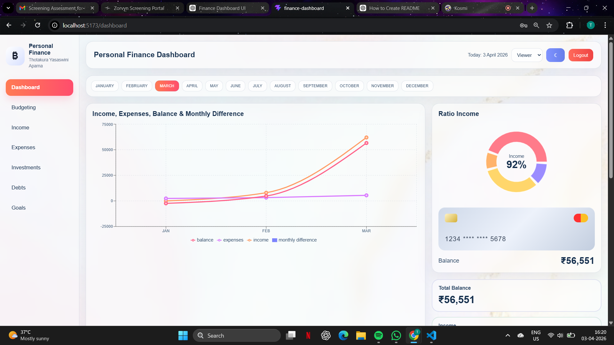
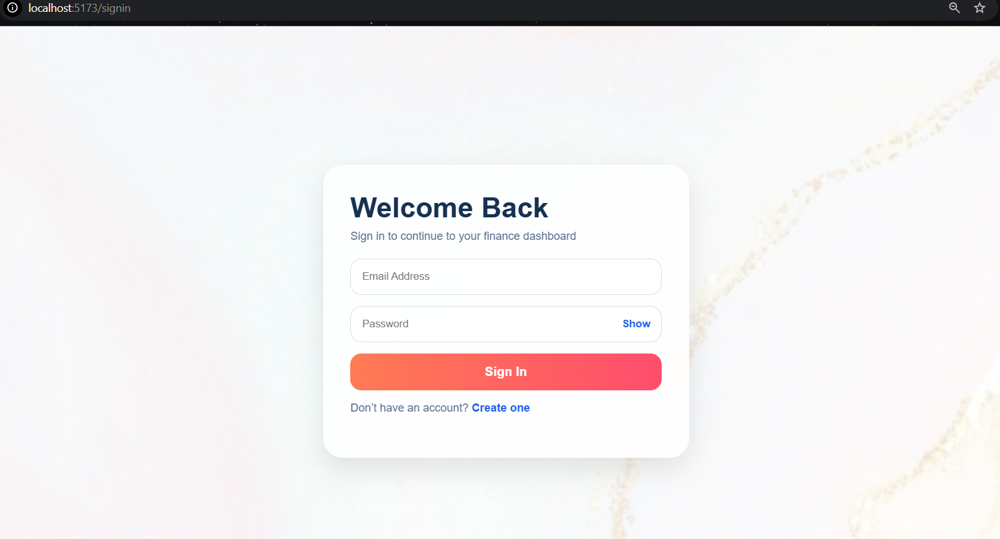
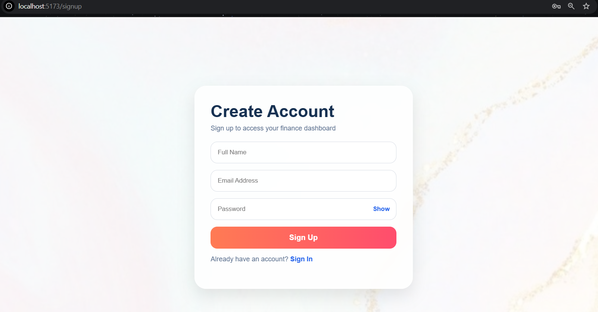

# 📊 Finance Dashboard


---

## 🚀 Live Demo

🔗 **Try it here:**
👉 https://finance-dashboard-ai-app-aparna.vercel.app/
---

## 📌 Overview

The **Finance Dashboard** is a modern web-based application that enables users to efficiently manage their personal finances. It allows users to track income, monitor expenses, and view their financial balance in real time through an interactive dashboard.

The project emphasizes simplicity, performance, and usability, making it suitable for everyday financial tracking and beginner-friendly usage.

💡 This project was built to simplify personal finance tracking using a lightweight frontend-only solution without backend complexity.
---

## 💡 Why This Project?

This project demonstrates my ability to build a complete frontend application with real-world use cases like authentication, data persistence, and state management without relying on a backend.


## 🎯 Key Highlights

✔️ Real-time financial tracking with instant UI updates  
✔️ Lightweight and high-performance app powered by Vite  
✔️ Clean and intuitive dashboard design  
✔️ Fully client-side application (no backend required)  
✔️ Beginner-friendly yet scalable architecture  

## ✨ Features

## ✨ Features

✔️ Add, edit, and delete transactions  
✔️ Track income and expenses  
✔️ Dynamic balance calculation  
✔️ Dashboard widgets (Income, Expenses, Balance)  
✔️ Month-based filtering (JAN → DEC)  
✔️ Interactive charts (income, expenses, balance trends)  
✔️ Category-wise spending breakdown  
✔️ Insights (highest spending category, monthly comparison)  
✔️ Search, filtering, and sorting  
✔️ CSV export functionality  
✔️ Role-based UI (Viewer/Admin)  
✔️ Dark and Light mode  
✔️ Persistent login and data using LocalStorage  
✔️ Responsive UI for different screen sizes  

---

## 🔄 State Management

The application uses React Hooks for managing state:

- useState → manages transactions, filters, and UI states  
- useEffect → synchronizes data with LocalStorage  
- useMemo → optimizes filtering and calculations  

Key states handled:
- Transactions data  
- Selected month  
- Filters and search  
- User role  
- Theme (dark/light)  

## 🏗️ Architecture / Flow

[User Input]
     ↓
[React Components]
     ↓
[State Management]
     ↓
[LocalStorage]
     ↓
[UI Re-render / Dashboard Update]

## 🛠️ Tech Stack

| Category | Technology           |
| -------- | -------------------- |
| Frontend | React (Vite)         |
| Language | JavaScript           |
| Styling  | CSS                  |
| Storage  | Browser LocalStorage |

---

## 📁 Project Structure

```
finance-dashboard/
│
├── src/
│   ├── components/      # Reusable UI components
│   ├── pages/           # Login, Signup, Dashboard
│   ├── App.jsx
│   ├── main.jsx
│
├── public/
├── index.html
├── package.json
└── README.md
```

---

## ⚙️ Installation

```bash
# Clone the repository
git clone https://github.com/Yasaswini638/finance-dashboard.git

# Navigate into the folder
cd finance-dashboard

# Install dependencies
npm install
```

---

## ▶️ Run the Project

```bash
npm run dev
```

🌐 Open in browser:
👉 http://localhost:5173

---

## 📖 Usage

1. 🔐 Sign up or log in
2. 💰 Add your initial income
3. 🧾 Record your expenses
4. 📊 View real-time balance
5. 📈 Analyze spending using dashboard widgets

---

### 📊 Dashboard View


### 🔐 Login Page


### 📝 Signup Page



---

## ⚠️ Important Note

If the dashboard opens directly or shows incorrect data:

```js
localStorage.clear();
```

Then refresh the browser.

---

## 🚧 Challenges Faced

- Managing state across multiple components  
- Ensuring data persistence without backend  
- Handling real-time UI updates  
- Designing a clean and user-friendly interface  


## 🔮 Future Enhancements

🚀 Advanced analytics and deeper insights
🚀 Backend integration (Node.js / Spring Boot)
🚀 Secure authentication (JWT)
🚀 Export reports (PDF/CSV)
🚀 Mobile responsive UI

---

## 🧠 Learning Outcomes

* React component-based architecture
* State and event handling
* LocalStorage data persistence
* UI/UX design principles
* Frontend project structuring

---

## 🌐 Deployment

You can deploy this project using:

* Vercel
* Netlify

Steps:

1. Push project to GitHub
2. Connect repo to Vercel/Netlify
3. Click **Deploy**

---

## 🤝 Contributing

Contributions are welcome!

1. Fork the repo
2. Create a branch
3. Make changes
4. Submit a Pull Request

---

## 📜 License

This project is licensed under the **MIT License**

---

## 👤 Author

**Thotakura Yasaswini**
🎓 B.Tech CSE Student

🔗 GitHub: https://github.com/Yasaswini638
🔗 LinkedIn: https://www.linkedin.com/in/thotakura-yasaswini-aparna-1491b1342/

---

## ⭐ Support

If you found this project useful, give it a ⭐ on GitHub!

---
